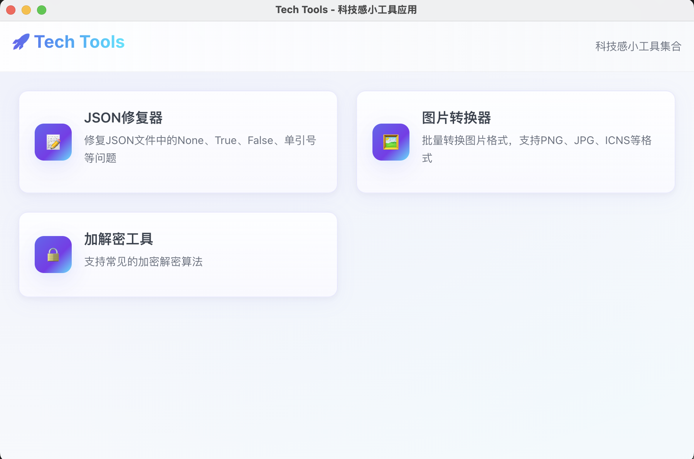

# Tech Tools



轻量、科技感的小工具集合，基于 Vue 3 + Vite + Ant Design Vue 打包为 Electron 应用。

主要功能

- 图片转换器（PNG/JPG/WEBP/ICNS 等）
- JSON 修复工具
- 加解密工具
- 更多实用小工具（见 `src/tools`）

快速开始

先安装依赖：

```bash
npm install
```

本地开发（渲染进程）:

```bash
npm run dev
```

启动 Electron 开发环境（会同时构建渲染进程并启动 Electron）:

```bash
npm run electron:dev
```

构建与发布

构建（含 types 校验和生产打包）:

```bash
npm run build
```

构建 Electron 可分发包（macOS/Linux/Windows）:

```bash
npm run electron:build
```

项目结构（摘要）

- `src/` - 源码
  - `App.vue` - 应用入口
  - `components/` - 公共 UI 组件（例如 `ToolCard.vue`）
  - `tools/` - 各小工具页面（图片转换器、JSON 修复、加解密等）
  - `styles/` - 全局样式
- `electron/` - Electron 主进程代码
- `scripts/` - 辅助脚本（如启动、打包相关）

图标和发布

- 应用图标位于 `assets/`，Electron 打包时会使用 `assets/icon.icns`（macOS）和 `assets/icon.png`（Windows/Linux）。

License

MIT

